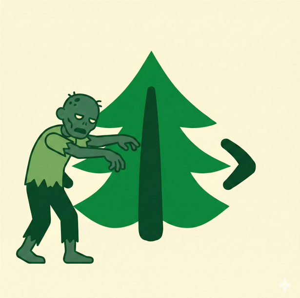
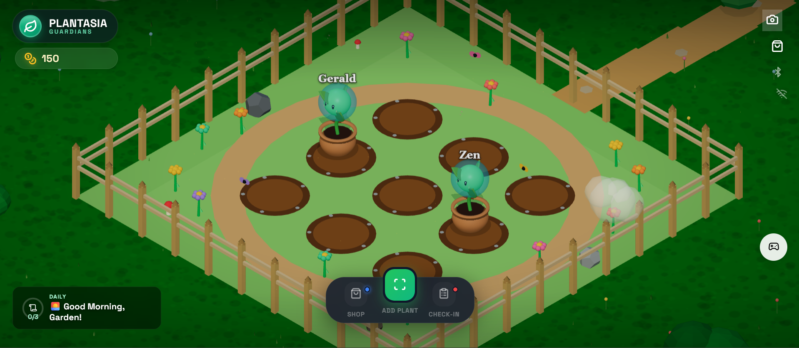
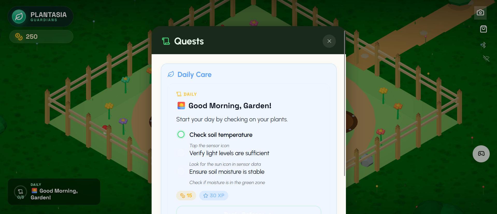
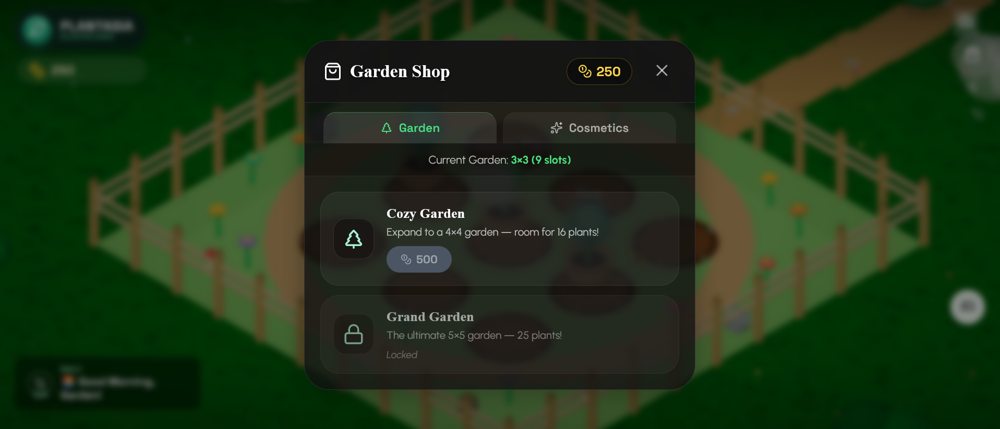
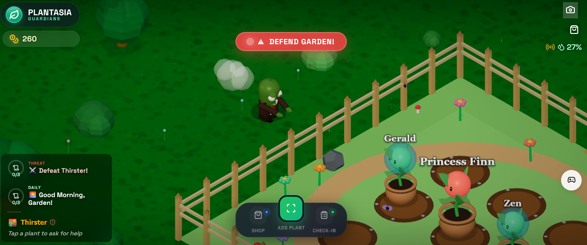

<div align="center">
  
  <h1>Plantasia</h1>
  <p><strong>Learn to keep your plants alive—by defending them from zombies.</strong></p>
  <p>
    <a href="https://devpost.com/software/plantasia">Devpost</a> ·
    <a href="https://github.com/suchithh/plantasia">Source</a>
  </p>
</div>

<p align="center">
  
  
</p>
<p align="center">
  
  
</p>

## What is Plantasia?

Plantasia turns real plant care into a colorful game inspired by *Plants vs. Zombies*. Scan a houseplant, give it a personality, and protect it from goofy disease-zombies by learning what it needs in real life.

A Bluetooth soil-moisture sensor connects your plant to the game. Water it, check in on it, and complete care quests to defeat threats such as:

- **Drownface** — root rot and overwatering
- **Thirster** — dehydration and underwatering
- More plant problems, quests, cosmetics, and garden upgrades to come

The goal is simple: make plant care feel less like a chore and more like an adventure.

## Highlights

- Interactive 3D garden built with React and Three.js
- AI-assisted plant identification, health analysis, chat, and quests
- Live soil-moisture updates over Bluetooth Low Energy
- Educational quests tied to actions you take in the real world
- Coins, streaks, cosmetics, and garden expansion

## Run locally

```bash
npm install
npm run dev
```

Build for production with:

```bash
npm run build
```

## Built with

`TypeScript` · `React` · `Three.js` · `Vite` · `Zustand` · `Framer Motion` · `ESP32` · `Bluetooth LE`

Created for **TreeHacks 2026**.

> Plantasia is a hackathon prototype. Hardware and AI-powered features may require additional configuration.
